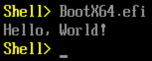

# HelloEFI

Simple Hello World EFI program that utilizes the [**GNU EFI**](http://gnu-efi.sourceforge.net/) environment.

The program's behavior can easily be modified in `src/main.c`

**Building on an AMD64 Linux-based operating system is strongly recommended. Otherwise, manually editing the Makefile may be required!**

## Dependencies

- Dependencies required for a default binary build:
    - **git**
    - **make**
    - **gcc**
    - **binutils**

- If you're building a bootable image, you additionally require:
    - **mtools**

- For testing with QEMU and OVMF firmware:
    - **qemu-full**
    - **ovmf**

## Building

- Clone the repository: `git clone https://github.com/FeltMacaroon389/HelloEFI.git`
- Enter the cloned directory: `cd HelloEFI`
- I suggest you read through `Makefile` and update any options you'd like to change.
- Run `make` to build the EFI binary.
    - The first time this is ran, it will automatically download **GNU EFI** source code and build it.
- Run `make help` for a list of targets.

## License
**HelloEFI** is licensed under the **GNU GPLv2** license. A copy of this license can be found at `LICENSE`

